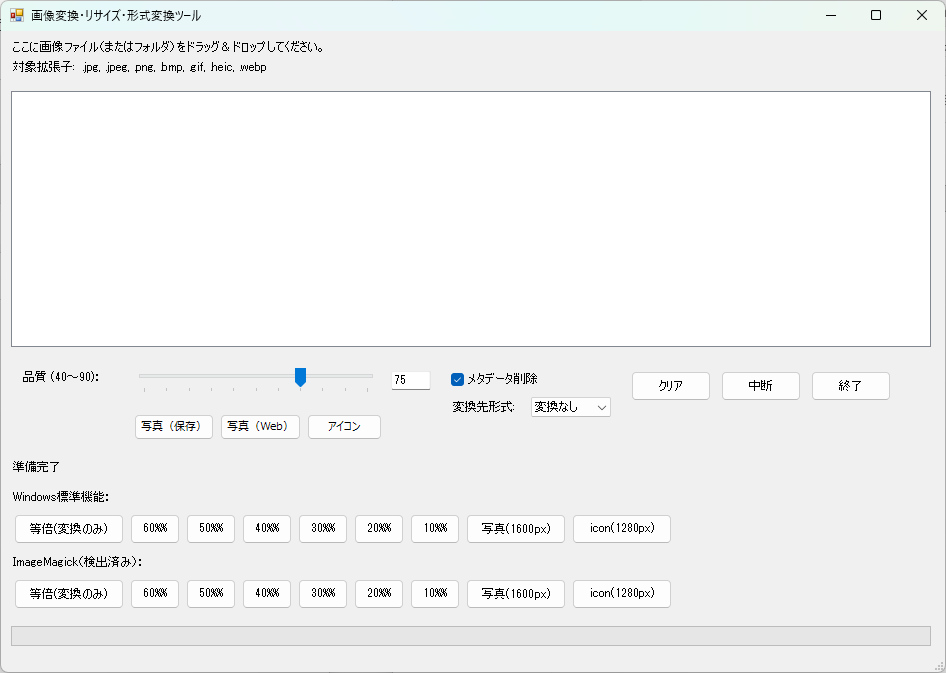

# ImageConverter-PS-GUI

ImageConverter-PS-GUI は、PowerShell で動作する **画像変換・リサイズ・形式変換ツール** です。  
GUI 操作により、写真や画像ファイルをまとめて処理できます。

主に以下のような用途を想定しています。

- 写真の解像度を一括で変更したい
- 画像形式（JPG / PNG / WebP / HEIC）を変換したい
- Box やクラウド保存向けに画像を最適化したい
- コマンド操作なしで安全に画像処理を行いたい



---

## 特徴

- PowerShell 標準＋ ImageMagick による安定した処理
- GUI 操作で初心者でも扱いやすい
- 解像度変更・形式変換を個別／同時に指定可能
- 写真用／アイコン用など用途別処理に対応
- 元画像を保持したまま別フォルダへ出力

---

## 主な機能

### 画像変換
- 解像度の一括変換（指定サイズ／比率維持）
- 解像度を変更せずに形式変換のみ実行
- 写真向け・アイコン向けの変換モード

### 対応形式
- 入力：JPG / PNG / WebP / HEIC
- 出力：JPG / PNG / WebP / 元形式

### 画質・最適化
- JPG 画質指定
- メタデータ（EXIF）保持／削除
- ImageMagick による高品質変換

---

## 動作環境

- Windows 10 / 11
- PowerShell 5.1 以上
- .NET Framework 4.7 以上
- ImageMagick（インストール必須）

※ HEIC を扱う場合は、HEIC 対応ビルドの ImageMagick が必要です。

---

## インストール

1. 本リポジトリを任意のフォルダに配置
2. ImageMagick をインストール
3. `ImageConverter-PS-GUI.ps1` を実行

PowerShell の実行ポリシーにより起動できない場合は、以下を参考にしてください。

```powershell
Set-ExecutionPolicy -ExecutionPolicy RemoteSigned -Scope CurrentUser
```

---

## 使い方

1. スクリプトを起動すると GUI 画面が表示されます
2. 変換したい画像ファイルを選択
3. 出力形式・解像度・画質などを指定
4. 実行ボタンを押すと一括変換が開始されます

変換後の画像は、元画像とは別のフォルダに出力されます。

---

## フォルダ構成（例）

```text
ImageConverter-PS-GUI
├─ ImageConverter-PS-GUI.ps1
├─ README.md
├─ Resized_photo
├─ Resized_icon
├─ ResizedIM_photo
└─ ResizedIM_icon
```

---

## 想定ユースケース

- 子ども写真を JPG 高品質で一括変換し Box に保存
- HEIC 写真を JPG にまとめて変換
- Web 掲載用に画像サイズを統一
- アイコン画像を指定サイズで量産

---

## 注意事項

- 元画像は上書きされません
- ImageMagick の設定・ビルドにより対応形式が異なる場合があります
- 大量ファイル処理時は十分な空き容量を確保してください

---

## ライセンス

個人利用・社内利用を想定しています。
再配布・改変については利用者の責任で行ってください。

---

## 更新履歴

- v1.x : 画像リサイズ中心の初期バージョン
- v2.0 : 形式変換機能追加（ImageConverter-PS-GUI へ改称）

---

## 作者メモ

本ツールは、日常的な写真整理・長期保存・業務用画像処理を効率化する目的で作成されています。
実運用で使いやすいことを最優先に設計しています。


---

## 🔄 ツール名称変更について（重要）

本ツールは機能拡張に伴い、**画像リサイズ専用ツール** から
**画像変換ツール** へ位置づけを変更しました。

### 新しい正式名称

```
ImageConverter-PS-GUI
```

### 変更理由
- 解像度変換（リサイズ）に加えて
- **画像形式の変換（JPG / PNG / WebP / HEIC）** を行う機能を追加したため
- 「変換ツール」であることが名前から直感的に分かるようにするため

---

## 🆕 新機能：画像形式変換

### 対応形式

- 入力：JPG / PNG / WebP / HEIC
- 出力：JPG / PNG / WebP / 元形式

### 特徴
- 解像度を変更せずに **形式変換のみ** 実行可能
- リサイズと形式変換の **同時実行** に対応
- 写真用途・保存用途に応じた形式選択が可能

---

## 📦 長期保存向けおすすめ設定

子ども写真や家族写真を **Box などのクラウドストレージで長期保存** する場合、
以下の設定を推奨します。

- 出力形式：**JPG**
- 画質：**90 前後**
- 解像度：元サイズ維持、または 1600px 程度
- メタデータ：必要に応じて位置情報のみ削除

これにより、
- 見た目の劣化を感じにくい
- ファイルサイズを抑えられる
- 将来の互換性が高い

というバランスの取れた保存が可能です。

---

## 📝 更新履歴（追記）

- v2.0
  - ツール名称を **ImageConverter-PS-GUI** に変更
  - 画像形式変換機能を追加
  - README を画像変換ツール前提で全面更新

## ライセンス

本プロジェクトは **MIT License** （または作成されたライセンス名）に基づき公開されています。
詳細は [LICENSE](./LICENSE) ファイルをご確認ください。

- 個人利用・社内利用を想定しています。
- 再配布・改変については利用者の責任で行ってください。

Copyright (c) 2024-2025 [kumayy-dev/ImageConverter-PS-GUI]
